# KubeCompass Visual Diagrams

This document contains visual representations of KubeCompass domains, subdomains, and decision layers to help you navigate the Kubernetes platform landscape.

---

## Table of Contents

1. [Domain Architecture Overview](#1-domain-architecture-overview)
2. [Decision Layer Visualization](#2-decision-layer-visualization)
3. [Scale-Based Deployment Models](#3-scale-based-deployment-models)
4. [CNCF Alignment Map](#4-cncf-alignment-map)
5. [Interactive Navigation Guide](#5-interactive-navigation-guide)

---

## 1. Domain Architecture Overview

### 1.1 Complete Domain Map

This diagram shows all 13 domains covered by KubeCompass and their relationships:

**Color Legend:**
- 🔴 **Red (Layer 0)**: Foundational - Decide Day 1 (High migration cost)
- 🟡 **Yellow (Layer 1)**: Core Operations - Within Month 1 (Medium migration cost)
- 🟢 **Green (Layer 2)**: Enhancement - Add as needed (Low migration cost)

### 1.2 Domain Dependency Flow

This diagram shows the logical flow and dependencies between domains:

```mermaid
flowchart LR
    subgraph Foundation["🏗️ Foundation"]
        direction TB
        INFRA[Infrastructure<br/>Provisioning]
        SECURITY[Identity &<br/>Security]
        NETWORK[Networking &<br/>CNI]
    end
    
    subgraph Deployment["🚀 Deployment Pipeline"]
        direction TB
        CICD[CI/CD]
        GITOPS[GitOps]
        REGISTRY[Container<br/>Registry]
    end
    
    subgraph Runtime["⚙️ Runtime Operations"]
        direction TB
        OBSERVE[Observability]
        STORAGE[Storage &<br/>Backup]
        MESSAGING[Message<br/>Brokers]
        CACHE[Data Stores<br/>& Cache]
    end
    
    subgraph Enhancement["✨ Enhancements"]
        direction TB
        RUNSEC[Runtime<br/>Security]
        DEVX[Developer<br/>Experience]
        POLICY[Governance<br/>& Policy]
    end
    
    Foundation --> Deployment
    Foundation --> Runtime
    Deployment --> Runtime
    Runtime --> Enhancement
    Foundation --> Enhancement
    
    style Foundation fill:#ffe0e0
    style Deployment fill:#fff4cc
    style Runtime fill:#fff4cc
    style Enhancement fill:#e0ffe0
```

---

## 2. Decision Layer Visualization

### 2.1 Decision Timing Model

This diagram illustrates when to make each type of decision:

### 2.2 Migration Cost Matrix

---

## 3. Scale-Based Deployment Models

### 3.1 Single Team Deployment

**Context**: Startup or small team (1-5 developers), focus on speed and simplicity

**Tool Decisions for Single Team:**
- **Infrastructure**: Managed Kubernetes (GKE, EKS, AKS)
- **Networking**: Cloud-native CNI (simple)
- **CI/CD**: GitHub Actions
- **GitOps**: Optional (Argo CD if scaling expected)
- **Observability**: Prometheus + Grafana
- **Storage**: Cloud provider CSI driver

**Decision Focus**: Speed to market, minimal complexity, leverage managed services

---

### 3.2 Multi-Team Deployment

**Context**: Growing company (20-100 developers, 3-10 teams), need for collaboration and isolation

**Tool Decisions for Multi-Team:**
- **Infrastructure**: Multi-zone, IaC with Terraform
- **Networking**: Cilium (L7 policies, team isolation)
- **Security**: RBAC + OPA + External Secrets Operator
- **CI/CD**: Team-specific pipelines
- **GitOps**: Argo CD with multi-tenant projects
- **Registry**: Harbor (scanning, multi-tenancy)
- **Observability**: Full stack (Prometheus, Loki, Tempo)
- **Storage**: CSI + Velero for backup
- **Developer Platform**: Backstage for self-service

**Decision Focus**: Team autonomy with governance, shared infrastructure, collaboration

---

### 3.3 Enterprise Deployment

**Context**: Large organization (100+ developers, 10+ teams), compliance, multi-region, high availability

**Tool Decisions for Enterprise:**
- **Infrastructure**: Multi-region, multi-cloud with Crossplane
- **Networking**: Cilium + Istio (zero-trust, L7 security)
- **Security**: Vault, OPA, SSO with Keycloak, audit everything
- **CI/CD**: Enterprise pipelines (GitLab, Jenkins)
- **GitOps**: Argo CD multi-cluster with SSO and RBAC
- **Registry**: Harbor HA with replication and signing
- **Observability**: Prometheus HA + VictoriaMetrics + ELK
- **Storage**: Rook-Ceph for on-prem + Velero for DR
- **Message Broker**: Kafka HA multi-DC
- **Cache**: Redis Cluster HA
- **Developer Platform**: Backstage with service catalog
- **Policy**: OPA + Kyverno for compliance
- **Cost**: Kubecost with chargeback
- **Runtime Security**: Falco + Tetragon
- **Governance**: Project management integration, compliance tracking, orchestration platform decisions

**Decision Focus**: Compliance, high availability, disaster recovery, multi-region, governance

---

## 4. CNCF Alignment Map

This diagram shows how KubeCompass domains map to CNCF Cloud Native Landscape categories:

📖 **[See detailed CNCF alignment analysis](CNCF_ALIGNMENT.md)**

---

## 5. Interactive Navigation Guide

### 5.1 Domain Deep-Dive Navigation

Use this map to navigate to specific domain documentation:

### 5.2 Decision Path Flowchart

Follow this flowchart to determine your starting point:

---

## Future Interactivity Roadmap

### Planned Interactive Features (Inspired by Scaled Agile Framework)

1. **Clickable Domain Cards**
   - Click on any domain to see detailed tool recommendations
   - Hover to see quick info and decision layer

2. **Filterable Views**
   - Filter by: Team size, compliance requirements, cloud provider
   - Show/hide domains based on maturity level (stable, beta, alpha)

3. **Guided Decision Wizard**
   - Step-by-step questionnaire
   - Generates custom architecture based on answers

4. **Tool Comparison Matrix**
   - Side-by-side tool comparisons
   - Interactive scoring (you rate, we show alternatives)

5. **Architecture Generator**
   - Select your constraints (team size, compliance, budget)
   - Auto-generate recommended architecture diagram
   - Export as Terraform/Helm starter kit

6. **Community Feedback Integration**
   - Upvote/downvote tool recommendations
   - Share your experience (works in production, doesn't work)
   - Real-time updates to recommendations

### Implementation Technologies (Future)

- **Static Site Generator**: Hugo or Next.js
- **Interactive Diagrams**: D3.js, Mermaid Live Editor
- **Backend**: GitHub API for community feedback
- **Deployment**: GitHub Pages or Vercel

---

## How to Use These Diagrams

1. **Start with Scale**: Identify your organization size (Section 3)
2. **Understand Layers**: Review decision layers (Section 2)
3. **Explore Domains**: Navigate the complete domain map (Section 1)
4. **Follow the Path**: Use the decision flowchart (Section 5.2)
5. **Deep Dive**: Click through to specific domain documentation

---

**Questions or Feedback?**

- 🐛 Found an error? [Open an issue](https://github.com/vanhoutenbos/KubeCompass/issues)
- 💡 Have a suggestion? [Start a discussion](https://github.com/vanhoutenbos/KubeCompass/discussions)
- 🎨 Want to improve diagrams? [Submit a PR](https://github.com/vanhoutenbos/KubeCompass/pulls)

---

*These diagrams are designed to evolve into an interactive platform similar to the Scaled Agile Framework's Big Picture. Stay tuned for interactive features!*
